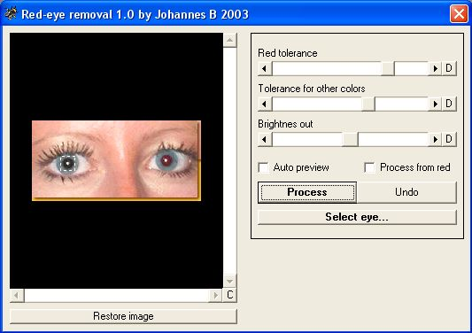



## Red\-eye removal \(image processing\)

### Description

This is a very simple and powerful tool for removing red eyes on photos caused by reflections is eye (when picture is taken).

This program works as good as commercial products!

But this one is free and you can use it in your own image programs. But please give me credits if you do. Comments would be nice so i know whats good/bad or can be better. A vote would also be nice =)
 
### More Info
 

             |
---                |---
**Submitted On**   |2003-08-02 14:27:04
**By**             |[Johannes B](https://github.com/Planet-Source-Code/PSCIndex/blob/master/ByAuthor/johannes-b.md)
**Level**          |Intermediate
**User Rating**    |5.0 (35 globes from 7 users)
**Compatibility**  |VB 5\.0, VB 6\.0
**Category**       |[Graphics](https://github.com/Planet-Source-Code/PSCIndex/blob/master/ByCategory/graphics__1-46.md)
**World**          |[Visual Basic](https://github.com/Planet-Source-Code/PSCIndex/blob/master/ByWorld/visual-basic.md)
**Archive File**   |[Red\-eye\_re162336822003\.zip](https://github.com/Planet-Source-Code/johannes-b-red-eye-removal-image-processing__1-47347/archive/master.zip)

